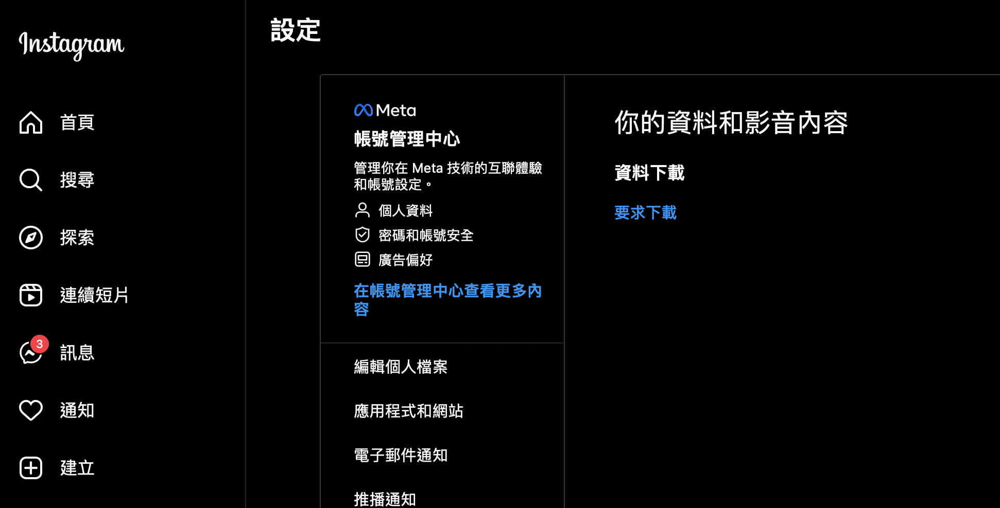
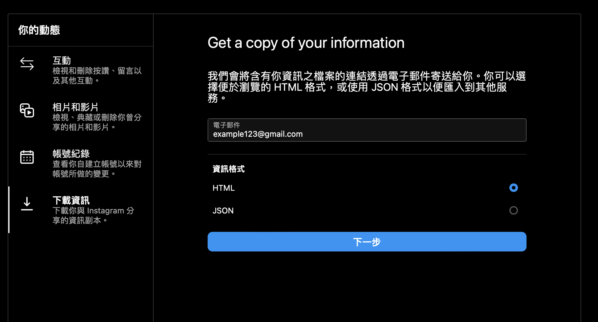
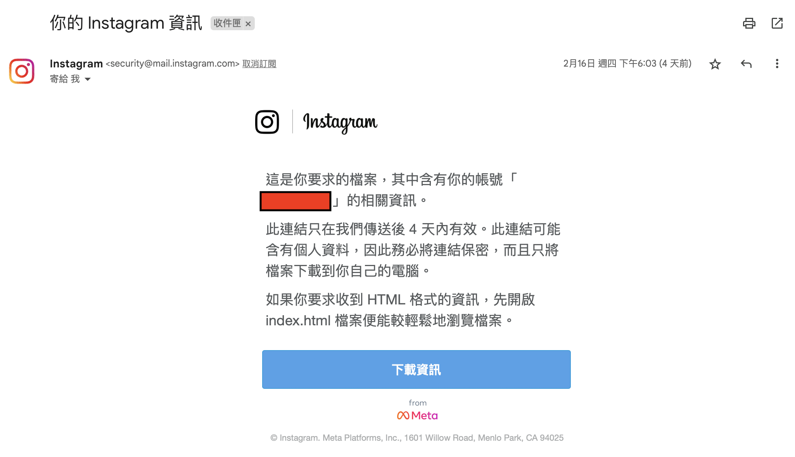
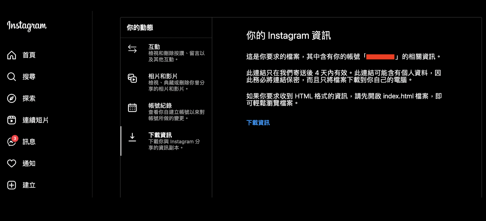
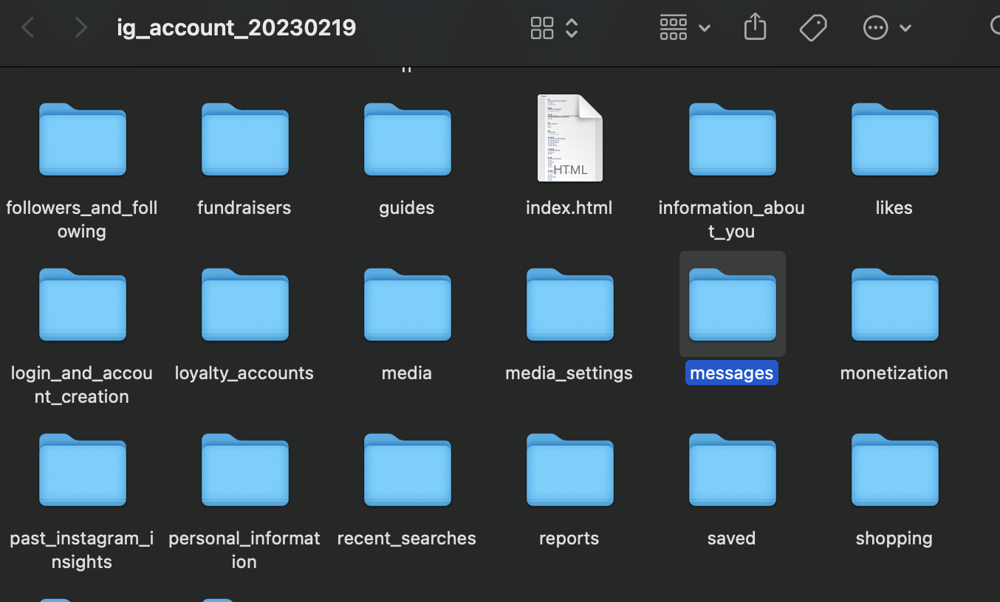
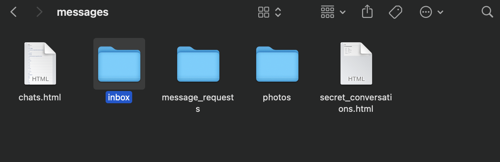
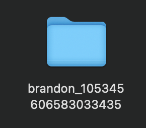
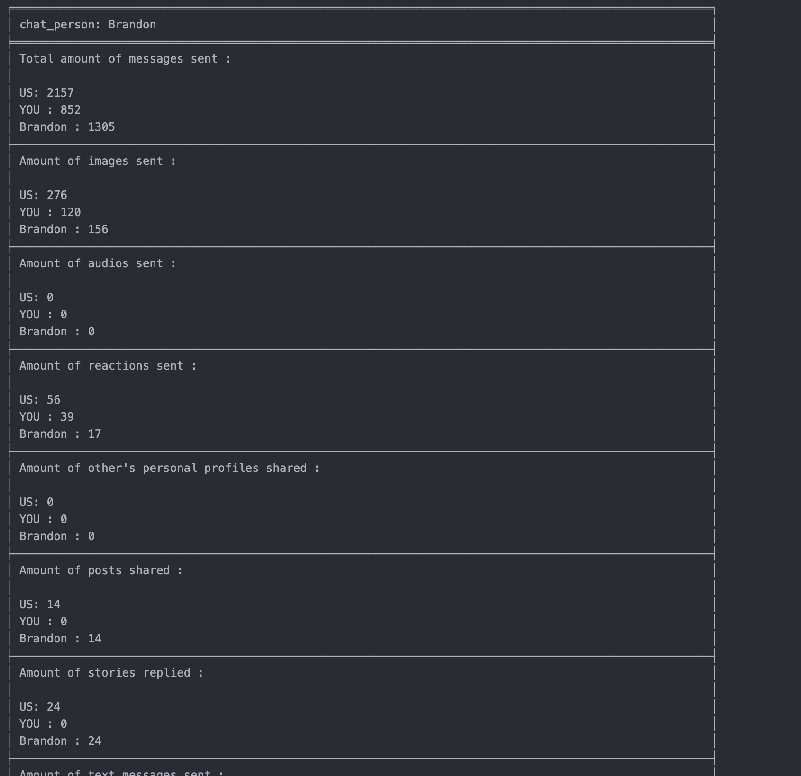

# **IG Message Analyzer**


## **Introduction** 

IG Message Analyzer , analyzes IG inbox messages , evaluates relationship : )

## **Motivation**

Just for fun~

*Wish this tool helps you , ENJOY LEARNING !*

***

## **Requirements**

Before you begin, ensure you have met the following requirements:

* You have a machine that is able to execute python 
* You have installed all python extensions in requirements.txt
* You have read the instructions for using IG Message Analyzer

***

## **How to install**

### To install, follow these steps:


1.
```
git clone https://github.com/deeeelin/messageanalyzer.git <folder path>
```

2. install required module in requirements.txt:

```
pip3 install -r <path of requirements.txt>
```

3.Go to the installed folder and execute main.py

***

## **How to use**


### Material gathering :

REQUEST MESSAGE RECORDS:

   1. Use your computer sign in IG , and go to settings->your files and media ->reuqest download

   
   2. Set download format as "HTML"


   3. Wait for the download url in mail


   4. Download the records



   5. Open download folder ,and go messages


   6. go to ->inbox 

    
   7. Find the folder name with the person's name you want to anlayze ,below example : lisa

    
   8. copy/paste the folder's path to the program , press enter


   9. Result document "text.txt" will be produce under the same folder of IG Message Analyzer.
    

**Sample result by following above instructions :**




## **Very welcome to make contributes to NTHU_SELECT**

To contribute to this project:

1. Fork this repository.
2. Create branch
3. Make changes and commit them
4. Push to your github
5. Create pull request.
6. Send a message to me via email

## **List of contributors**

* [@deeeelin](https://github.com/deeeelin) 

## **Contact me**

If you want to contact me you can reach me at <dereklin100503@gmail.com>

## **MIT License**

This project uses the following license: [MIT License](https://choosealicense.com/licenses/mit/#).

***

